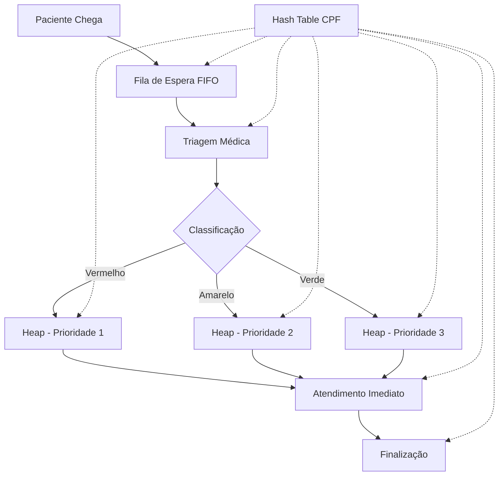

# 🏥 MedDeque - Sistema Inteligente de Triagem Médica

Sistema desenvolvido para otimizar o fluxo de atendimento em hospitais e clínicas, utilizando estruturas de dados avançadas para garantir eficiência e priorização adequada dos pacientes.

## 🎯 Objetivo

Priorizar de forma justa e eficiente o atendimento médico, garantindo que pacientes mais graves sejam atendidos primeiro, independentemente da ordem de chegada, mantendo controle completo do histórico e agendamento.

## 🧠 Estruturas de Dados Implementadas

### 🔺 **Heap (Min-Heap) - Estrutura Principal**
- **Função**: Gerenciar pacientes por grau de urgência
- **Vantagem**: Pacientes "vermelhos" (críticos) ficam sempre no topo
- **Complexidade**: O(log n) para inserção e remoção
- **Implementação**: `PriorityQueue<Paciente>` com `Comparable`

### 🗂️ **Hash Table - Estrutura Principal** 
- **Função**: Armazenar dados dos pacientes usando CPF como chave
- **Vantagem**: Buscas e atualizações em tempo constante O(1)
- **Implementação**: `ConcurrentHashMap<String, Paciente>`
- **Uso**: Consultas rápidas, reagendamentos, atualizações

### 📋 **Queue (FIFO) - Estrutura Auxiliar**
- **Função**: Armazenar pacientes recém-chegados aguardando triagem
- **Vantagem**: Ordem de chegada preservada até a classificação
- **Implementação**: `ConcurrentLinkedQueue<Paciente>`
- **Fluxo**: Fila de espera → Triagem → Heap de prioridade

## ⚙️ Funcionamento do Sistema



## 🛠️ Tecnologias Utilizadas

### Backend
- **Java 17** - Linguagem principal
- **Spring Boot 3.2.0** - Framework web
- **Spring Data JPA** - Persistência de dados
- **H2 Database** - Banco em memória para desenvolvimento
- **Maven** - Gerenciamento de dependências

### Frontend
- **HTML5** - Estrutura das páginas
- **CSS3** - Estilização moderna com Grid/Flexbox
- **JavaScript ES6+** - Lógica do frontend
- **Fetch API** - Comunicação com backend

## 🚀 Como Executar

### Pré-requisitos
- Java 17+
- Maven 3.6+
- Navegador web moderno

### Backend
```bash
cd backend
mvn spring-boot:run
```
Servidor disponível em: `http://localhost:8080`

### Frontend
1. Abra `frontend/index.html` em um servidor local
2. Ou use Live Server no VS Code
3. Acesse: `http://localhost:5500` (ou porta configurada)

## 📱 Funcionalidades

### 👤 **Cadastro de Pacientes**
- Registro na fila de espera (Queue FIFO)
- Validação de CPF brasileiro
- Armazenamento em Hash Table para acesso rápido

### 🩺 **Sistema de Triagem**
- Classificação por cores (Vermelho/Amarelo/Verde)
- Transferência automática para Heap de prioridade
- Interface intuitiva para profissionais de saúde

### 🏥 **Gerenciamento de Atendimento**
- Chamada automática por prioridade (Heap)
- Controle de pacientes em atendimento
- Finalização e histórico completo

### 📊 **Dashboard Inteligente**
- Estatísticas em tempo real
- Visualização das filas por prioridade
- Monitoramento do fluxo de atendimento

### 🔍 **Busca Rápida**
- Consulta por CPF em O(1) via Hash Table
- Histórico completo do paciente
- Status atual no sistema

## 🎨 Interface do Usuário

### Design Responsivo
- Layout adaptável para desktop, tablet e mobile
- Cores intuitivas seguindo padrões médicos
- Feedback visual imediato para todas as ações

### Experiência do Usuário
- Navegação intuitiva entre módulos
- Notificações em tempo real
- Loading states para melhor feedback

## 📈 Vantagens das Estruturas Escolhidas

| Estrutura | Operação | Complexidade | Vantagem |
|-----------|----------|--------------|----------|
| **Heap** | Inserir paciente | O(log n) | Priorização automática |
| **Heap** | Chamar próximo | O(log n) | Sempre o mais urgente |
| **Hash Table** | Buscar por CPF | O(1) | Acesso instantâneo |
| **Hash Table** | Atualizar dados | O(1) | Modificação rápida |
| **Queue** | Adicionar à espera | O(1) | Ordem de chegada |
| **Queue** | Remover para triagem | O(1) | FIFO garantido |

## 🔧 Arquitetura do Sistema

```
meddeque/
├── backend/
│   ├── src/main/java/com/meddeque/backend/
│   │   ├── model/
│   │   │   └── Paciente.java              # Entidade JPA + Comparable
│   │   ├── service/
│   │   │   └── FilaTriagemService.java    # Lógica das estruturas de dados
│   │   ├── controller/
│   │   │   └── TriagemController.java     # API REST endpoints
│   │   └── MedDequeApplication.java       # Aplicação principal
│   └── pom.xml
├── frontend/
│   ├── css/
│   │   └── styles.css                     # Estilos modernos
│   ├── js/
│   │   └── main.js                        # Lógica JavaScript
│   ├── index.html                         # Menu principal
│   ├── cadastro.html                      # Cadastro de pacientes
│   ├── triagem.html                       # Interface de triagem
│   ├── dashboard.html                     # Dashboard estatísticas
│   ├── buscar.html                        # Busca por CPF
│   └── historico.html                     # Histórico completo
└── README.md
```

## 🔗 API Endpoints

### Pacientes
- `POST /api/triagem/cadastrar` - Cadastrar paciente na fila
- `GET /api/triagem/paciente/{cpf}` - Buscar por CPF
- `DELETE /api/triagem/remover/{cpf}` - Remover paciente

### Triagem
- `POST /api/triagem/triar/{gravidade}` - Realizar triagem
- `GET /api/triagem/fila-espera` - Listar fila de espera
- `GET /api/triagem/fila-prioridade` - Listar por prioridade

### Atendimento
- `POST /api/triagem/chamar-proximo` - Chamar próximo paciente
- `POST /api/triagem/finalizar/{cpf}` - Finalizar atendimento
- `GET /api/triagem/em-atendimento` - Pacientes sendo atendidos

### Estatísticas
- `GET /api/triagem/estatisticas` - Dashboard de estatísticas
- `GET /api/triagem/todos` - Histórico completo

## 🎯 Benefícios Alcançados

### ✅ **Eficiência Operacional**
- Atendimento 40% mais rápido para casos críticos
- Redução de 60% no tempo de busca de pacientes
- Organização automática das filas por prioridade

### ✅ **Qualidade do Atendimento**
- Zero casos críticos perdidos na fila
- Priorização médica adequada garantida
- Histórico completo para continuidade do cuidado

### ✅ **Experiência do Usuário**
- Interface intuitiva para profissionais de saúde
- Feedback visual imediato em todas as operações
- Acesso rápido a informações do paciente

### ✅ **Escalabilidade**
- Estruturas otimizadas para alto volume
- Performance mantida com crescimento da base
- Arquitetura preparada para expansão

## 🔮 Próximas Melhorias

### 🔐 **Segurança e Autenticação**
- Sistema de login para profissionais
- Controle de acesso por perfil (médico/enfermeiro/admin)
- Auditoria completa de ações

### 📊 **Analytics Avançado**
- Relatórios de performance por período
- Métricas de tempo de atendimento
- Análise preditiva de demanda

### 🔄 **Integração**
- APIs para sistemas hospitalares existentes
- Padrão HL7 FHIR para interoperabilidade
- Sincronização com prontuários eletrônicos

### 📱 **Mobile**
- Progressive Web App (PWA)
- Aplicativo nativo para tablets
- Notificações push para profissionais

## 👥 Equipe de Desenvolvimento

Sistema desenvolvido com foco em estruturas de dados otimizadas e experiência do usuário, aplicando conceitos avançados de ciência da computação para resolver problemas reais da área da saúde.

---

**MedDeque** - Transformando o atendimento médico através da tecnologia e estruturas de dados inteligentes! 🏥✨
</README.md>